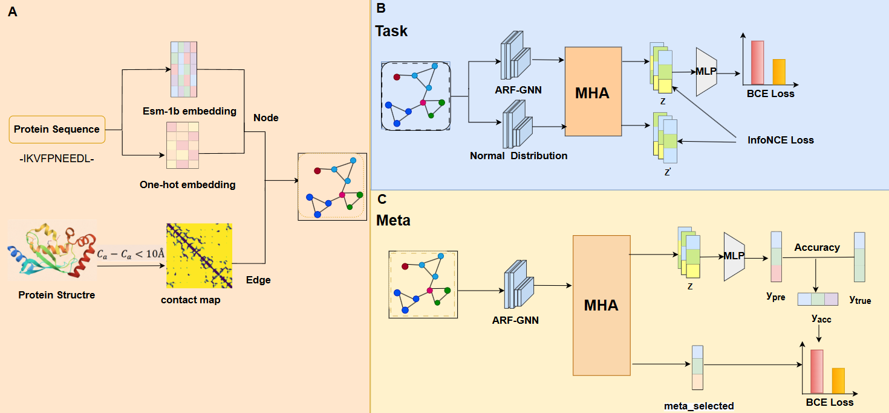

ARF-GNN
====
Adaptive Receptive Field Graph Neural Network for Protein Function Prediction
---

## Setup Environment

Clone the current repo

    conda env create -f environment.yml
    conda install pytorch==1.7.0 cudatoolkit=10.2 -c pytorch
    wget https://data.pyg.org/whl/torch-1.7.0%2Bcu102/torch_cluster-1.5.9-cp37-cp37m-linux_x86_64.whl
    wget https://data.pyg.org/whl/torch-1.7.0%2Bcu102/torch_scatter-2.0.7-cp37-cp37m-linux_x86_64.whl
    wget https://data.pyg.org/whl/torch-1.7.0%2Bcu102/torch_sparse-0.6.9-cp37-cp37m-linux_x86_64.whl
    wget https://data.pyg.org/whl/torch-1.7.0%2Bcu102/torch_spline_conv-1.2.1-cp37-cp37m-linux_x86_64.whl
    pip install *.whl
    pip install torch_geometric==1.6.3

## Model training

    cd data

Our data set can be downloaded from [here](https://disk.pku.edu.cn/link/AA9492E7A07058431A96EFE67487FB8921).

    tar -zxvf processed.tar.gz

The dataset related files will be under `data/processed`.
#### To train the model:

    python train.py --device 0
                    --task bp 
                    --batch_size 64 
                    --suffix CLaf
                    --contrast True
                    --AF2model True 
                    --max_hop 4
#### To test the model
    
    python test.py --device 0
                   --task bp
                   --model ./model/model_bp.pt
                   --max_hop 4 